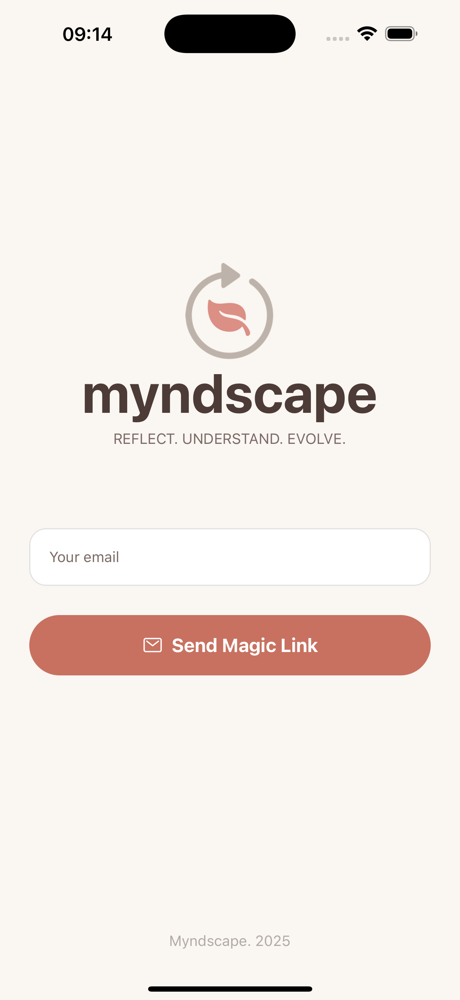
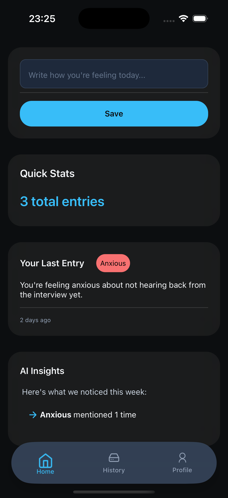
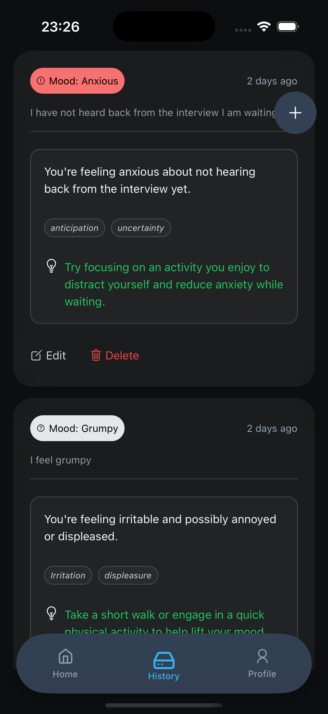
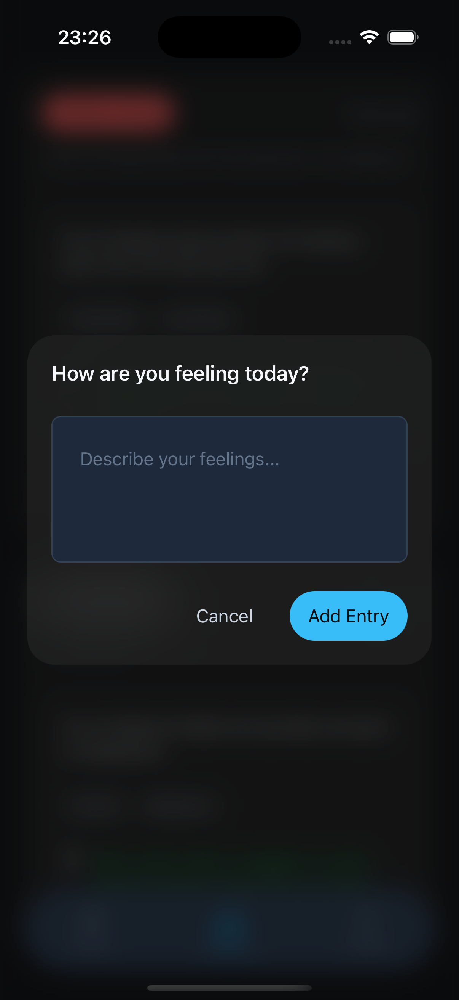
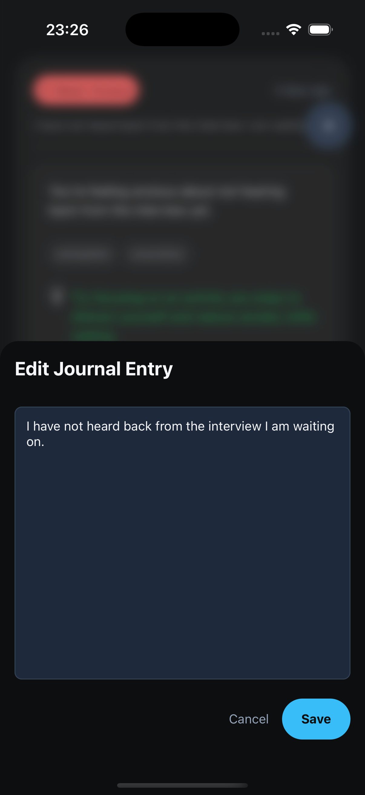
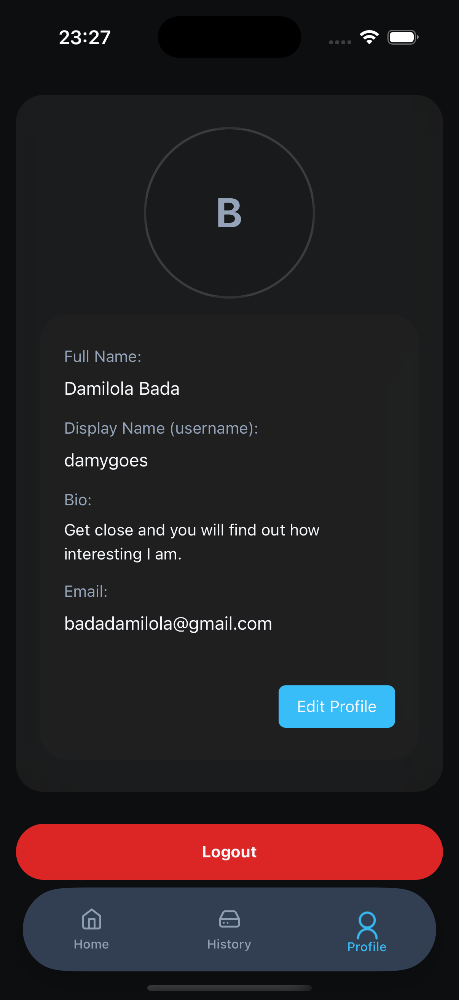

# 🌿 Reflekt — A Wellness & Journaling Mobile App

Reflect is a beautifully minimalistic mobile journaling app focused on mental clarity, self-reflection, and emotional tracking. Built using **React Native**, **Expo**, and **Supabase**, it provides a glassy, soothing UI with real-time authentication and storage.

## ✨ Features

- 🧘‍♀️ **Daily Mood Tracking** – Get mood feedback like anxious, excited, tired, and more.
- 📓 **Journaling** – Write daily entries to reflect on your thoughts, emotions, and progress.
- 🧠 **Wellness-Oriented Colors** – Calming dark theme with mood-based palette.
- 🔒 **Auth via Supabase** – Secure email-based login and session management.
- 🖼 **Avatar Uploads** – Glass UI with avatar upload support to Supabase Storage.
- 🔍 **Blurred Cards & UI** – Native glassmorphism with `expo-blur` and `react-native` for both platforms.
- ⚛️ Built using **React Native + Expo Router**

## 📱 Screenshots

<!-- You can upload screenshots here once available -->

| Login                        | Home                        | History                        | Journal Entry                      | Edit Journal                        | Profile                        |
| ---------------------------- | --------------------------- | ------------------------------ | ---------------------------------- | ----------------------------------- | ------------------------------ |
|  |  |  |  |  |  |

## 🛠️ Tech Stack

| Tech                                                              | Purpose                                  |
| ----------------------------------------------------------------- | ---------------------------------------- |
| [Expo](https://expo.dev/)                                         | App scaffolding, build, and deployment   |
| [React Native](https://reactnative.dev/)                          | Core framework for native UI             |
| [Expo Router](https://expo.github.io/router/docs)                 | File-based routing system                |
| [Supabase](https://supabase.com/)                                 | Backend as a service (Auth, DB, Storage) |
| [Expo Blur](https://docs.expo.dev/versions/latest/sdk/blur-view/) | Glass UI / blur effects                  |
| [clsx](https://www.npmjs.com/package/clsx)                        | Utility for conditional styling          |

## ⚙️ Installation

### 1. Clone the repo

```bash
git clone https://github.com/damygoes/reflect.git

cd reflect-app
```

### 2. Install dependencies

```bash
npm install
```

### 3. Set up environment variables

Create a .env file in the root:

```bash
SUPABASE_URL=https://your-project.supabase.co

SUPABASE_ANON_KEY=your-anon-key
```

### 4. Run the app

```bash
npx expo start
```

Then scan the QR code using your device, or use Android/iOS simulator.

## 📂 Folder Structure

```bash
    .
    ├── README.md
    ├── app.json
    ├── assets
    │   ├── adaptive-icon.png
    │   ├── favicon.png
    │   ├── icon.png
    │   └── splash-icon.png
    ├── babel.config.js
    ├── global.css
    ├── metro.config.js
    ├── nativewind-env.d.ts
    ├── package-lock.json
    ├── package.json
    ├── src
    │   ├── app
    │   │   ├── (tabs)
    │   │   │   ├── _layout.tsx
    │   │   │   ├── history.tsx
    │   │   │   ├── index.tsx
    │   │   │   └── profile.tsx
    │   │   ├── _layout.tsx
    │   │   └── login.tsx
    │   ├── components
    │   │   ├── card
    │   │   │   └── Card.tsx
    │   │   ├── floating-button
    │   │   │   └── FloatingButton.tsx
    │   │   ├── layouts
    │   │   │   ├── SafeScrollView.tsx
    │   │   │   └── ThemedSafeAreaView.tsx
    │   │   └── tab-bar
    │   │       ├── HapticTab.tsx
    │   │       ├── TabBar.tsx
    │   │       ├── TabBarBackground.tsx
    │   │       └── TabBarButton.tsx
    │   ├── features
    │   │   ├── auth
    │   │   │   ├── components
    │   │   │   │   ├── AuthContext.tsx
    │   │   │   │   ├── LoginForm.tsx
    │   │   │   │   └── LogoutButton.tsx
    │   │   │   └── hooks
    │   │   │       ├── useAuthActions.ts
    │   │   │       └── useDeepLinkSession.ts
    │   │   ├── dashboard
    │   │   │   ├── components
    │   │   │   │   ├── AiInsights.tsx
    │   │   │   │   ├── LastEntrySummary.tsx
    │   │   │   │   ├── MoodPrompt.tsx
    │   │   │   │   ├── QuickStats.tsx
    │   │   │   │   └── TipCard.tsx
    │   │   │   └── utils
    │   │   │       ├── analyzeEntries.ts
    │   │   │       ├── generateMoodTipMessage.ts
    │   │   │       └── getTipForMood.ts
    │   │   ├── journal-entries
    │   │   │   ├── api
    │   │   │   │   └── callAnalyzeEntryFunction.ts
    │   │   │   ├── components
    │   │   │   │   ├── EditJournalEntry.tsx
    │   │   │   │   ├── EditJournalModal.tsx
    │   │   │   │   ├── JournalCreationDialog.tsx
    │   │   │   │   ├── JournalEntries.tsx
    │   │   │   │   ├── JournalEntryInput.tsx
    │   │   │   │   └── JournalEntryList.tsx
    │   │   │   ├── hooks
    │   │   │   │   ├── useCreateJournalEntry.ts
    │   │   │   │   ├── useDeleteJournalEntry.ts
    │   │   │   │   ├── useHandleJournalEntryCreation.ts
    │   │   │   │   ├── useJournalEntries.ts
    │   │   │   │   ├── useJournalEntryById.ts
    │   │   │   │   └── useUpdateJournalEntry.ts
    │   │   │   ├── jornal-entry-item
    │   │   │   │   ├── components
    │   │   │   │   ├── constants.ts
    │   │   │   │   └── utils.ts
    │   │   │   ├── store
    │   │   │   │   ├── useJournalEntriesStore.ts
    │   │   │   │   └── useJournalEntryAnalysisStore.ts
    │   │   │   └── types.ts
    │   │   └── profile
    │   │       ├── components
    │   │       │   ├── ProfileAvatar.tsx
    │   │       │   ├── ProfileDetails.tsx
    │   │       │   └── ProfileDetailsWithAvatar.tsx
    │   │       └── hooks
    │   │           ├── useUpdateUserProfile.ts
    │   │           └── useUserProfile.ts
    │   ├── lib
    │   │   └── queryKeys.ts
    │   ├── providers
    │   │   └── theme
    │   │       ├── AppThemeContext.ts
    │   │       └── AppThemeProvider.tsx
    │   ├── scripts
    │   │   └── seedDatabase.ts
    │   ├── services
    │   │   └── supabase.ts
    │   └── utils
    │       ├── clsx.ts
    │       ├── colors.ts
    │       └── moodUtils.ts
    ├── supabase
    │   ├── config.toml
    │   └── functions
    │       └── analyzeEntry
    │           ├── deno.json
    │           └── index.ts
    ├── tailwind.config.js
    └── tsconfig.json
```

## 📦 Dependencies Overview

- expo, react-native, expo-router

- @supabase/supabase-js

- expo-blur, expo-image-picker

- clsx for conditional class merging

- @expo/vector-icons for consistent icons

## 🚀 Deployment

You can build the app with Expo:

```bash
npx expo build:android

npx expo build:ios
```

Or use EAS Build for advanced workflows.

## 🤝 Contributing

If you'd like to contribute:

- Fork this repo

- Create a new branch: git checkout -b feature/feature-name

- Commit your changes

- Push your branch: git push origin feature/feature-name

- Submit a Pull Request

## 📄 License

MIT License © 2025 Damilola Bada

## 🙌 Acknowledgements

- Supabase

- Expo

- GitHub Primer

- Inspiration from wellness-focused UI kits and Apple’s glass design aesthetics.
